<div align="center">

# n8n Self-Hosted & Local Deployment


</div>

A comprehensive Docker-based self-hosted / local deployment setup for n8n workflow automation platform with advanced features, monitoring, and production-ready configurations.

## Architecture Overview

The cloud deployment architecture shows the main components and data flow:

```mermaid
%%{init: {'theme':'base', 'themeVariables': {'background': 'transparent', 'primaryColor': 'transparent', 'primaryTextColor': '#666666', 'primaryBorderColor': '#888888', 'lineColor': '#888888', 'edgeLabelBackground': 'rgba(255,255,255,0.8)', 'clusterBkg': 'transparent', 'clusterBorder': '#888888'}}}%%
graph TB
    subgraph "Users & External Systems"
        USER["👤 Users"]
        EXTERNAL["🌐 External APIs"]
    end
    
    subgraph "Cloud Infrastructure"
        ALB["⚖️ Load Balancer<br/>HTTPS & Traffic Distribution"]
        
        subgraph "Application Layer"
            N8N_APPS["🔧 n8n Services<br/>• Main App<br/>• Workers<br/>• Webhooks"]
        end
        
        subgraph "Data Layer"
            DATABASE["🗄️ PostgreSQL<br/>Workflows & Data"]
            CACHE["⚡️ Redis<br/>Queue & Cache"]
        end
        
        subgraph "Storage"
            FILES["🪣 Object Storage<br/>Files & Backups"]
        end
        
        subgraph "Security & Monitoring"
            SECURITY["🛡️ Security<br/>WAF & Secrets"]
            MONITORING["📊 Monitoring<br/>Logs & Metrics"]
        end
    end
    
    %% User connections
    USER -->|HTTPS| ALB
    EXTERNAL -->|Webhooks| ALB
    
    %% Traffic flow
    ALB --> N8N_APPS
    
    %% Application connections
    N8N_APPS --> DATABASE
    N8N_APPS --> CACHE
    N8N_APPS --> FILES
    
    %% Security & Monitoring
    SECURITY --> N8N_APPS
    N8N_APPS --> MONITORING
    
    %% Soft harmonious color palette with gentle contrast
    classDef users fill:#e8f4f8,stroke:#b8d4da,stroke-width:2px,color:#2c5282,font-weight:bold,font-size:14px
    classDef network fill:#f0f4ff,stroke:#c3dafe,stroke-width:2px,color:#3c366b,font-weight:bold,font-size:14px
    classDef app fill:#fef5e7,stroke:#f6e05e,stroke-width:2px,color:#744210,font-weight:bold,font-size:14px
    classDef data fill:#e6fffa,stroke:#81e6d9,stroke-width:2px,color:#234e52,font-weight:bold,font-size:14px
    classDef storage fill:#f0fff4,stroke:#9ae6b4,stroke-width:2px,color:#22543d,font-weight:bold,font-size:14px
    classDef support fill:#fff5f5,stroke:#feb2b2,stroke-width:2px,color:#742a2a,font-weight:bold,font-size:14px
    
    class USER,EXTERNAL users
    class ALB network
    class N8N_APPS app
    class DATABASE,CACHE data
    class FILES storage
    class SECURITY,MONITORING support
```



## Table of Contents

- [Architecture Overview](#architecture-overview)
- [Features](#features)
- [Quick Start](#quick-start)
- [Architecture](#architecture)
- [Features](#features-1)
- [Prerequisites](#prerequisites)
- [Quick Start](#quick-start-1)
  - [Option A: Using Just (Recommended)](#option-a-using-just-recommended)
  - [Option B: Manual Setup](#option-b-manual-setup)
- [Directory Structure](#directory-structure)
- [Configuration](#configuration)
  - [Environment Variables](#environment-variables)
  - [Custom Nodes](#custom-nodes)
  - [External Hooks](#external-hooks)
- [Service Management](#service-management)
  - [Basic Commands](#basic-commands)
  - [Health Checks](#health-checks)
- [HTTPS Setup](#https-setup)
- [Monitoring and Logging](#monitoring-and-logging)
- [Backup and Restore](#backup-and-restore)
  - [Using Just Task Runner](#using-just-task-runner)
  - [Service Management](#service-management-1)
  - [Backup and Restore](#backup-and-restore-1)
  - [Monitoring and Debugging](#monitoring-and-debugging)
  - [Testing and Utilities](#testing-and-utilities)
- [Troubleshooting](#troubleshooting)
  - [Common Issues](#common-issues)
  - [Debug Mode](#debug-mode)
- [Updates](#updates)
- [Development](#development)
  - [Custom Node Development](#custom-node-development)
  - [External Hook Development](#external-hook-development)

### Key Components

- **🌐 Load Balancer** - HTTPS termination and traffic distribution
- **🔧 n8n Services** - Main app, workers, and webhook handlers
- **🗄️ PostgreSQL** - Primary database for workflows and data
- **⚡️ Redis** - Queue management and caching
- **🪣 Object Storage** - Files, backups, and binary data
- **🛡️ Security & Monitoring** - WAF, secrets, logging, and metrics

## Features

- **Production-Ready**: Full PostgreSQL + Redis + n8n stack
- **HTTPS Support**: Optional Caddy reverse proxy with automatic TLS
- **Queue Management**: Redis-powered background job processing
- **Monitoring**: Health checks and comprehensive logging
- **Backup System**: Automated backup and restore functionality
- **Security**: Secure key generation and environment management
- **External Hooks**: Custom workflow and credential event handling
- **Worker Processes**: Dedicated worker and webhook processes

## Quick Start

1. **Clone and Setup**:

```bash
git clone <repository-url>
cd n8n-self-hosted
chmod +x scripts/setup.sh
./scripts/setup.sh
```

2. **Access n8n**: Open <http://localhost:5678> in your browser

3. **Optional HTTPS**: Enable with `docker compose --profile https up -d`

## Architecture

- **n8n Main**: Workflow editor and API (port 5678)
- **n8n Worker**: Background task processing
- **n8n Webhook**: High-throughput webhook handling (port 5679)
- **PostgreSQL**: Persistent data storage (port 5432)
- **Redis**: Queue and cache management (port 6379)
- **Caddy**: Optional HTTPS termination (ports 80/443)

## n8n Self-Hosted / Local Deployment

A robust, production-ready self-hosted / local deployment of n8n using Docker Compose. This setup includes PostgreSQL database, Redis queue management, and optional HTTPS support via Caddy reverse proxy.

## Features

- **Self-hosted n8n** - Full-featured workflow automation platform
- **PostgreSQL Database** - Reliable data persistence
- **Redis Queue Management** - Scalable workflow execution
- **Worker Process** - Dedicated background job processing
- **Webhook Process** - High-performance webhook handling
- **HTTPS Support** - Optional SSL termination with Caddy
- **Custom Nodes** - Support for custom node development
- **External Hooks** - Extensible backend hooks
- **Backup & Restore** - Complete backup/restore system with validation
- **Service Management** - Convenient start/stop scripts with multiple modes
- **Test Suite** - Comprehensive testing for backup/restore functionality
- **Monitoring Ready** - Built-in health checks and logging

## Prerequisites

- Docker Engine 20.10+
- Docker Compose 2.0+
- At least 2GB RAM available
- 10GB free disk space (recommended)

## Quick Start

### Option A: Using Just (Recommended)

```bash
# 1. Clone the repository
git clone https://github.com/tjs-w/local-n8n-deployment n8n-self-hosted
cd n8n-self-hosted

# 2. Install just (if not already installed)
brew install just  # macOS
# or: cargo install just

# 3. Run setup and start
just setup
just start

# 4. Access n8n at: http://localhost:5678
```

### Option B: Manual Setup

### 1. Clone and Setup

```bash
git clone https://github.com/tjs-w/local-n8n-deployment n8n-self-hosted
cd n8n-self-hosted
```

### 2. Configure Environment

```bash
# Copy the environment template
cp env.template .env

# Edit the environment variables
nano .env
```

**Important**: Update these critical environment variables in your `.env` file:

- `N8N_ENCRYPTION_KEY` - Generate a secure 32+ character key
- `N8N_JWT_SECRET` - Generate a secure 32+ character secret
- `POSTGRES_PASSWORD` - Set a strong database password

### 3. Generate Secure Keys

```bash
# Generate encryption key
openssl rand -hex 32
# or: just gen-key

# Generate JWT secret
openssl rand -hex 32
# or: just gen-jwt
```

### 4. Start the Services

```bash
# Start all services
docker compose up -d
# or: just start

# Check service status
docker compose ps
# or: just status

# View logs
docker compose logs -f n8n
# or: just logs-n8n
```

### 5. Access n8n

Open your browser and navigate to: <http://localhost:5678>

## Directory Structure

```text
n8n-self-hosted/
├── README.md                 # This file
├── docker compose.yml        # Main Docker Compose configuration
├── env.template             # Environment variables template
├── .env                     # Your environment variables (create from template)
├── backups/                 # n8n backups storage
├── custom-nodes/           # Custom node development
├── external-hooks/         # Backend hooks and extensions
├── init-scripts/           # Database initialization scripts
├── logs/                   # Application logs
├── scripts/                # Utility scripts
├── shared/                 # Shared files between host and containers
└── caddy/                  # Caddy configuration (for HTTPS)
    ├── Caddyfile
    ├── data/
    └── config/
```

## Configuration

### Environment Variables

Key environment variables you should configure:

| Variable | Description | Default |
|----------|-------------|---------|
| `N8N_ENCRYPTION_KEY` | Encryption key for credentials | **Required** |
| `N8N_JWT_SECRET` | JWT secret for user sessions | **Required** |
| `POSTGRES_PASSWORD` | Database password | **Required** |
| `N8N_HOST` | n8n host | `localhost` |
| `N8N_PORT` | n8n port | `5678` |
| `WEBHOOK_URL` | Webhook base URL | `http://localhost:5678/` |
| `TIMEZONE` | System timezone | `UTC` |

### Custom Nodes

Place your custom nodes in the `custom-nodes/` directory:

```bash
# Install a custom node
cd custom-nodes/
npm install n8n-nodes-your-custom-node
```

### External Hooks

Create backend hooks in `external-hooks/external-hooks.js`:

```javascript
module.exports = {
  workflow: {
    activate: [
      async function(workflowData) {
        console.log('Workflow activated:', workflowData.name);
      }
    ]
  }
};
```

## Service Management

### Basic Commands

```bash
# Start services
docker compose up -d

# Stop services
docker compose down

# Restart a specific service
docker compose restart n8n

# View logs
docker compose logs -f [service-name]

# Scale workers
docker compose up -d --scale n8n-worker=3
```

### Health Checks

```bash
# Check service health
docker compose ps

# PostgreSQL health
docker compose exec postgres pg_isready -U n8n

# Redis health
docker compose exec redis redis-cli ping

# n8n health
curl http://localhost:5678/healthz
```

## HTTPS Setup

To enable HTTPS with automatic SSL certificates:

### 1. Configure Caddy

Create `caddy/Caddyfile`:

```caddyfile
your-domain.com {
    reverse_proxy n8n:5678
    
    # Optional: Basic auth
    # basicauth {
    #     admin $2a$14$...your-bcrypt-hash
    # }
}
```

### 2. Update Environment

```bash
# Update your .env file
N8N_HOST=your-domain.com
N8N_PROTOCOL=https
WEBHOOK_URL=https://your-domain.com/
```

### 3. Start with HTTPS Profile

```bash
docker compose --profile https up -d
```

## Monitoring and Logging

### Log Locations

- **n8n logs**: `./logs/`
- **Container logs**: `docker compose logs [service]`
- **PostgreSQL logs**: Within container at `/var/lib/postgresql/data/log/`

### Log Levels

Set log level in `.env`:

```bash
N8N_LOG_LEVEL=debug  # error, warn, info, debug
```

### Metrics (Optional)

Enable metrics collection:

```bash
N8N_METRICS=true
N8N_METRICS_PREFIX=n8n_
```

## Backup and Restore

### Using Just Task Runner

This deployment includes a comprehensive `justfile` for easy management. Install `just` first:

```bash
# Install just (choose one)
brew install just                    # macOS
cargo install just                   # Cross-platform
curl --proto '=https' --tlsv1.2 -sSf https://just.systems/install.sh | bash -s -- --to /usr/local/bin
```

#### Quick Start with Just

```bash
# Show all available commands
just

# Setup and start n8n
just setup
just start

# Common operations
just health                          # Check service health
just logs-n8n                       # View n8n logs
just backup                         # Create backup
just backup-list                    # List backups
just stop                           # Stop services
```

#### Service Management

```bash
# Start n8n services (multiple modes available)
just start                          # Normal start
just start-https                    # Start with HTTPS
just start-dev                      # Start in development mode
just start-https-dev                # HTTPS + development mode

# Stop n8n services (multiple options)
just stop                           # Graceful stop
just stop-force                     # Force stop without confirmation
just stop-clean                     # Stop and remove all data (⚠️ DESTRUCTIVE!)
just restart                        # Restart services
```

#### Backup and Restore

```bash
# Create and manage backups
just backup                         # Create backup
just backup-list                    # List available backups

# Restore operations
just restore                        # Interactive restore selection
just restore-date 20250622_143000   # Restore specific backup
just restore-workflows DATE         # Restore only workflows
just restore-database DATE          # Restore only database
just restore-force DATE             # Force restore without confirmation
```

#### Monitoring and Debugging

```bash
# Service monitoring
just health                         # Comprehensive health check
just status                         # Container status
just logs-n8n                       # n8n logs
just logs-db                        # Database logs
just stats                          # Resource usage

# Development tools
just shell                          # Open shell in n8n container
just db-connect                     # Connect to PostgreSQL
just redis-cli                      # Connect to Redis CLI
just version                        # Show n8n version
```

#### Testing and Utilities

```bash
# Run tests
just test                           # Run backup/restore tests
just test-quick                     # Quick tests

# Utilities
just urls                           # Show all service URLs
just check-deps                     # Check required dependencies
just update                         # Update to latest n8n version
just clean-containers               # Clean up stopped containers
```

## Troubleshooting

### Common Issues

#### Service Won't Start

```bash
# Check service logs
just logs-n8n

# Verify environment variables
just env
```

#### Database Connection Issues

```bash
# Test database connection
just db-info

# Reset database (⚠️ DESTRUCTIVE)
just stop-clean
just start
```

#### Permission Issues

```bash
# Fix ownership issues
sudo chown -R $USER:$USER ./logs ./backups ./custom-nodes
```

#### Memory Issues

```bash
# Check container memory usage
just stats

# Increase memory limits in docker compose.yml
```

### Debug Mode

Enable debug logging:

```bash
# In .env file
N8N_LOG_LEVEL=debug

# Restart services
just restart
```

## Updates

### Update n8n

```bash
# Update to latest version
just update
```

### Update PostgreSQL

```bash
# Backup first!
just backup

# Update image version in docker compose.yml
# Then restart
just restart
```

## Development

### Custom Node Development

1. Create your node in `custom-nodes/`
2. Install dependencies
3. Restart n8n to load new nodes

```bash
cd custom-nodes/
npm init -y
npm install n8n
# Develop your custom node
just restart
```

### External Hook Development

1. Edit `external-hooks/external-hooks.js`
2. Restart n8n to apply changes

```bash
# After editing external-hooks.js
just restart
```
